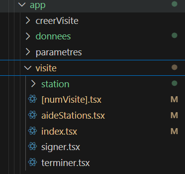

== React Native c'est quoi ?
[.notes]
--
Composants 'react native' traduits en composants Natifs
--
image::images/diagram-react.svg[]

=== Organisation de l'app
[.notes]
--
'Pages' comme en web organisées en dossier
--

=== Export Default Function
.terminer.tsx
[source, tsx]
--
export default function Terminer() {
    return <WithSmallHeader title="Terminer">
        <ThemedText>Terminer la visite !</ThemedText>
    </WithSmallHeader>
}
--