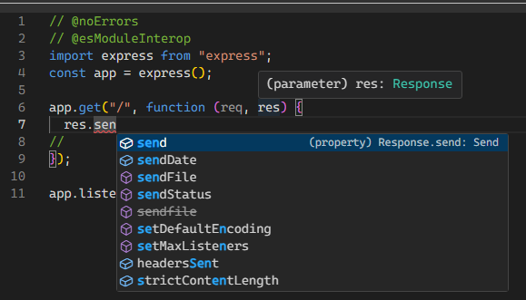

== React Native c'est quoi ?
[.notes]
--
Composants 'react native' traduits en composants Natifs
--
image::images/diagram-react.svg[]

=== Typescript

[source, typescript]
----
message.toLowerCase();
message();
----
[%step]
* Est ce que message a une propriété toLowerCase ?
* Est ce que message est appellable ?

=== !

=== Types

[%step]
[source, typescript]
----
type texte = string
----
[%step]
[source, typescript]
----
type constante = 'Hello World'
----
[%step]
[source, typescript]
----
type status = 'loading' | 'ready' | 'erreur'
----

=== Composants

[source,tsx]
--
return <View>
    <Text>Bonjour</Text>
</View>
--