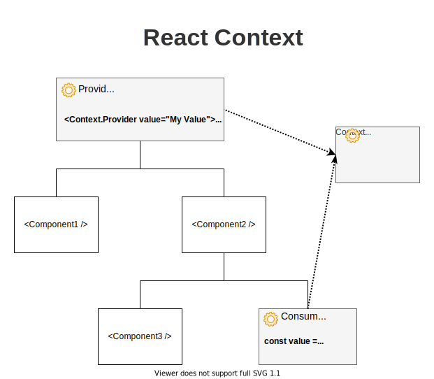

== React

=== Composants: JSX

[source,tsx]
--
<View>
    <Text>Bonjour</Text>
</View>
--

=== Code JS
[%step]
[source, tsx]
--
return <View>
    const name = 'toto'
    <Text>Bonjour, name.toUpperCase() !</Text>
</View>
--
[%step]
[source, tsx]
--
const name = 'toto'
return <View>
    <Text>Bonjour, {name.toUpperCase()} !</Text>
</View>
--

=== Styles
[source,tsx]
--
const style = {
    backgroundColor: 'red',
    marginBottom: 20
}
--
[source,tsx]
--
<View style={style}>
</View>
--

=== !
[source,tsx]
--
import { StyleSheet } from 'react-native'; // important

const styles = StyleSheet.create({
    container: {
        backgroundColor: 'red',
        marginBottom: 20
    },
    text: {
        color: 'blue'
    }
})
--
[source,tsx]
--
<View style={styles.container}>
    <Text style={styles.text}>Ce texte est bleu sur fond rouge !</Text>
</View>
--

=== Hooks
[source, tsx, highlight=3]
--
export default function Terminer() {
    return <WithSmallHeader title="Terminer">
        <ThemedText>Terminer visite N° : {params.numVisite}</ThemedText>
    </WithSmallHeader>
}
--

=== useLocalSearchParam
[source, tsx]
--
import { useLocalSearchParams } from "expo-router"
--

=== !
[source, tsx]
--
import { useLocalSearchParams } from "expo-router"

type Params = {
    numVisite: string
}

export default function Terminer() {
    const params = useLocalSearchParams() as Params
    return <WithSmallHeader title="Terminer">
        <ThemedText>Terminer ! numVisite : {params.numVisite}</ThemedText>
    </WithSmallHeader>
}
--

=== useState

[source, tsx]
--
import {useState} from 'react';
import {Text, View, Button} from 'react-native';

export default function PressApp() {
  const [numberPressed, setNumberPressed] = useState(0)
  return (
    <View>
      <Text>Clicked {numberPressed} times !</Text>
      <Button title='Press Me !' onPress={() => setNumberPressed(numberPressed + 1)}/>
    </View>
  );
}
--
https://snack.expo.dev/@zolorah/usestate-demo[Test-It, window=_blank]

=== Context

=== !
.Provider
[source, tsx]
--
export default function RootLayout() {
  return <SQLite.SQLiteProvider databaseName="its.db">
    <App/>
  </SQLite.SQLiteProvider>
}
--
.Consumer
[%step]
[source, tsx]
--
const db = useSQLiteContext()
await db.runAsync(req)
--

=== React Rendering
image::images/reactRenderDiagram.png[]

=== useEffect
[.notes]
--
* S'exécute après le montage et le rendering
* Permet de contrôler quand le code va se réexécuter
* Premier argument est une fonction a exécuter
* Second argument est dépendences
* Pas de dépendences -> Exécuté à chaque render
* Dépendences vides -> exécuté une seule fois
* Dépendances avec une valeur, réexécuté lorsque la dépendance change
--
[%step]
[source, tsx]
--
useEffect(() => {
  doSomething(value)
})
--
[%step]
[source, tsx]
--
useEffect(() => {
  doSomething()
}, [])
--
[%step]
[source, tsx]
--
useEffect(() => {
  doSomething(value)
}, [value]) 
--
