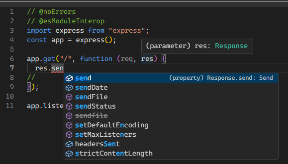
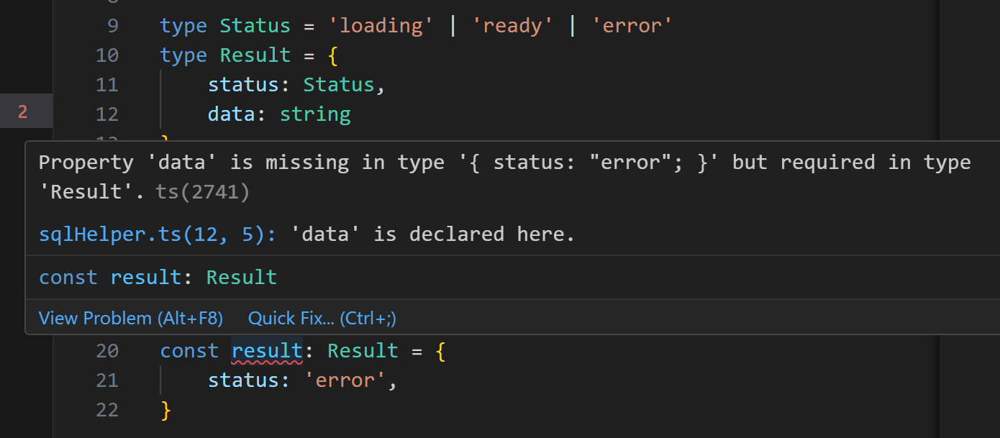
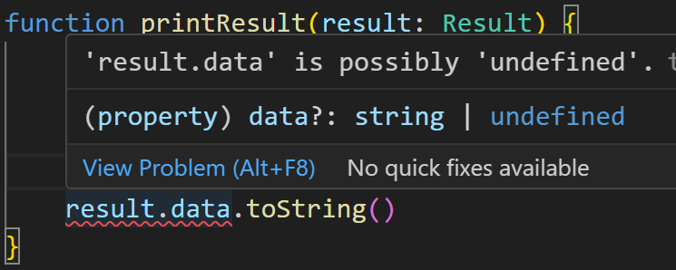

== Typescript

=== Pourquoi typescript ?
[source, typescript]
----
message.toLowerCase();
message();
----
[%step]
* Est ce que message a une propriété toLowerCase ?
* Est ce que message est appellable ?

=== !

=== Types

[%step]
[source, typescript]
----
const bonjour: string = 'Hello World'
----
[%step]
[source, typescript]
----
type Texte = string
const bonjour: Texte = 'Hello World'
----
[%step]
[source, typescript]
----
type Constante = 'Hello World'
----
[%step]
[source, typescript]
----
type Value = number | string
----
[%step]
[source, typescript]
----
type Status = 'loading' | 'ready' | 'error'
----

=== Plus de types
[%step]
[source, typescript]
----
type User = {
    nom: string,
    prenom: string,
    age: number
}
----
[%step]
[source, typescript]
----
type UserLong = User & {
    dateNaissance: Date,
    villeNaissance: string
}
----

=== Cas pratique

[source, typescript]
----
type Status = 'loading' | 'ready' | 'error'
----
[%step]
[source, typescript]
----
type Result = {
    status: Status,
    data: string
}
----
[%step]
[source, typescript]
----
const result: Result = {
    status: 'ready',
    data: 'This is data'
}
----

=== Problème

=== !

[source, typescript]
----
type Status = 'loading' | 'ready' | 'error'

type Result = {
    statut: Status,
    data?: string
}

// (property) data?: string | undefined
----

=== MAIS !

=== Types Génériques

[source, typescript]
----
type Result<T> = {
    status: Status,
    data: T
}
const resultString: Result<string> = {status: 'ready', data: 'Bonjour'}
const resultNumber: Result<number> = {status: 'ready', data: 20}
----

=== Solution
[source, typescript]
----
type Status = 'loading' | 'ready' | 'error'

export type Result<T> = {
    status: 'loading'
} | {
    status: 'ready'
    data: T
} | {
    status: 'error'
    error?: Error
}
----